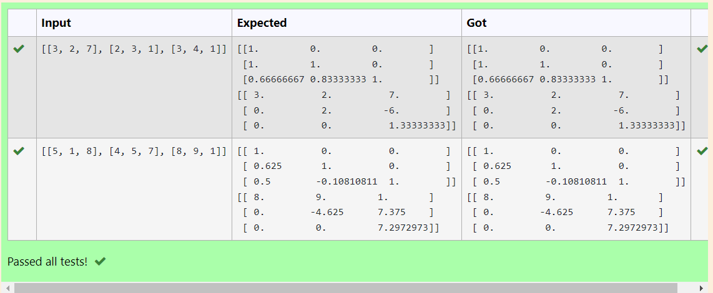

# LU Decomposition 

## AIM:
To write a program to find the LU Decomposition of a matrix.

## Equipments Required:
1. Hardware – PCs
2. Anaconda – Python 3.7 Installation / Moodle-Code Runner

## Algorithm
1. Import function fron package
2. Import lu factor
3. Get input from the user
4. assign a variable for the code

## Program:
(i) To find the L and U matrix
```
import numpy as np
from scipy.linalg import lu
A = np.array(eval(input()))
P,L,U=lu(A)
print(L)
print(U)
/*
Program to find the L and U matrix.
Developed by: 
RegisterNumber: 
*/
```
(ii) To find the LU Decomposition of a matrix
```import numpy as np
from scipy.linalg import lu_factor, lu_solve
A = np.array(eval(input()))
b = np.array(eval(input()))
lu, piv = lu_factor(A)
x = lu_solve((lu, piv), b)
print(x)
/*
Program to find the LU Decomposition of a matrix.
Developed by: 
RegisterNumber: 
*/
```

## Output:



## Result:
Thus the program to find the LU Decomposition of a matrix is written and verified using python programming.

